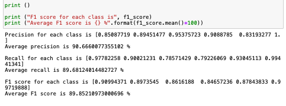
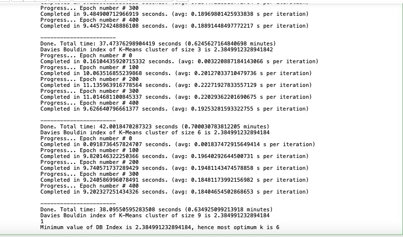

# Classification and Clustering on HAR Dataset, UCI Machine Learning Repository
Saad Bazaz				i180621

Bachelors of Computer Science, National University of Computing and Emerging Sciences, Islamabad, Pakistan.

Submitted to: Dr Labiba Fahad

## ABSTRACT
The objective was to construct and apply K Nearest Neighbors and K Means Clustering classification algorithms on a dataset of our choice, and display metrics and visualizations of the results.
Keywords – Classification, Clustering, Machine Learning, Human Activity Recognition
Date of Submission: 13-06-2021

## I. INTRODUCTION
Human activity recognition aims to infer the actions of one or more persons from a set of observations captured by sensors. I obtained HAR data from the UCI Machine Learning Repository. This data had been obtained from a Galaxy S2 phone strapped to the waist of 30 participants. The values are numeric and represent the phone’s gyroscope and accelerometer’s data for each activity.

## II. DATA DESCRIPTION
An array of around 9000 feature vectors, each with 500+ attributes related to averages, standard deviations etc of the sensor data, was provided in a file. These were recorded activities performed by participants, hence there were corresponding two files with labels of the activity out of six possible labels:
1             WALKING
2    WALKING_UPSTAIRS
3  WALKING_DOWNSTAIRS
4             SITTING
5            STANDING
6              LAYING
And another file with the IDs of participants who performed the activity, in the range of 1-30.

### 2.2 Pre-processing
The data was already split into Train and Test sets. I loaded these into Pandas Dataframes, and examined the data.
I then converted these Dataframes to Numpy arrays, as the data was numerical. This greatly decreased the computation time.

## III. ALGORITHM APPROACHES
### 3.1 K Nearest Neighbors
For KNN, I loaded the <X/y>_<train/test>.txt files, as they fitted more to the machine learning problem and model. 

### 3.1.1 Algorithm
I used the brute-force technique of KNN where each input row would be compared to the entire training set using a distance metric, and the resulting k minimum values would be returned, alongwith their corresponding labels.
Then using a majority vote, the label was selected.
The distance metric used was L2 Norm.

### 3.1.2 Result Evaluation
I evaluated the results using Pandas built in crosstab function. I used this function to create the confusion matrix, from which I derived the True Positive, False Positive, True Negative and False Negative values.
I used these values to evaluate precision, recall and F1 score.
I achieved good results:

### 3.2 K Means
For K Means, I loaded the files in the “Inertial Signals” directory, which contained raw sensor data in 3 Dimensions. 

### 3.2.1 Dimensional Reduction using PCA
Principal Component Analysis, or PCA, is an unsupervised learning algorithm that is used for dimensionality reduction in machine learning.
The raw data I had contained sensor data in X, Y, and Z. This was ideal to plot on a 3-D plane, but the problem was that each plane had feature vectors with 128 attributes, on their own.
So I used PCA to reduce the dimensions of each plane from 128 to 1. Although it led to a loss in data and the understanding of the data, it allowed me to safely proceed with the algorithm.

### 3.2.2 Algorithm
I used the standard algorithm which we had completed in Lab Assignment #13, Section-A Spring 2021. 
This comprised of:
Function which calculates the Closest centroids of each element in an array
Function which generates new Centroids based on the existing ones
The main loop which runs for certain n epochs 
I first attempted this in 2-D using the data from the previous algorithm (K Nearest Neighbors). Which was the <X/y>_<train/test>.txt data.
Then I attempted it in 3-D using the data I mentioned in the beginning of this section.

### 3.2.3 Result Evaluation
We were required to evaluate the optimum value of k using the DB Index technique.
Davies–Bouldin (or DB) index is an internal evaluation scheme, where the validation of how well the clustering has been done is made using quantities and features inherent to the dataset.
The expected results were that the number of clusters, k, should be equal to the number of classes the data actually had (mentioned earlier, WALKING, WALKING UPSTAIRS… etcetera).
Since K Means is unsupervised, if the optimum value of k was equal to the number of classes then the clustering was successful.
The results of my tests showed success:

## REFERENCES

[1] Lab work, https://classroom.google.com/u/1/c/MjcyNjE0NTY5MzM5/a/MzUwMjM3Nzg0MTU3/details

[2] K Means from Scratch, https://mmuratarat.github.io/2019-07-23/kmeans_from_scratch

[3] Efficient K Nearest Neighbors, https://research.project-10.de/efficient-k-nearest-neighbours/
